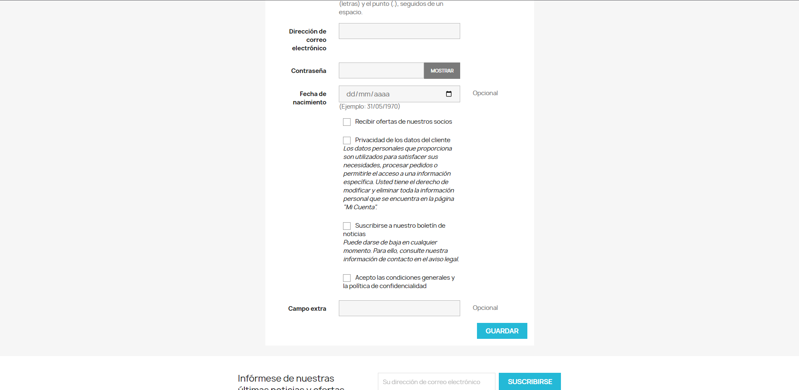

# Campo extra en formulario y validación de edad 18+

## ¿Como funciona?

## Campo extra
El módulo añade un campo extra en el formulario de contacto y esta información es guardada en la base de datos, concretamente en la tabla `ps_customer` para luego ser utilizado a conveniencia.

## Validación de edad mayor a 18 años
Una vez enviado el formulario, este valida si la fecha de nacimiento supera los 18 años de edad. Si es mayor a 18, se registra. Si no es mayor a 18, no puede registrarse.

<strong>Preview:</strong>

